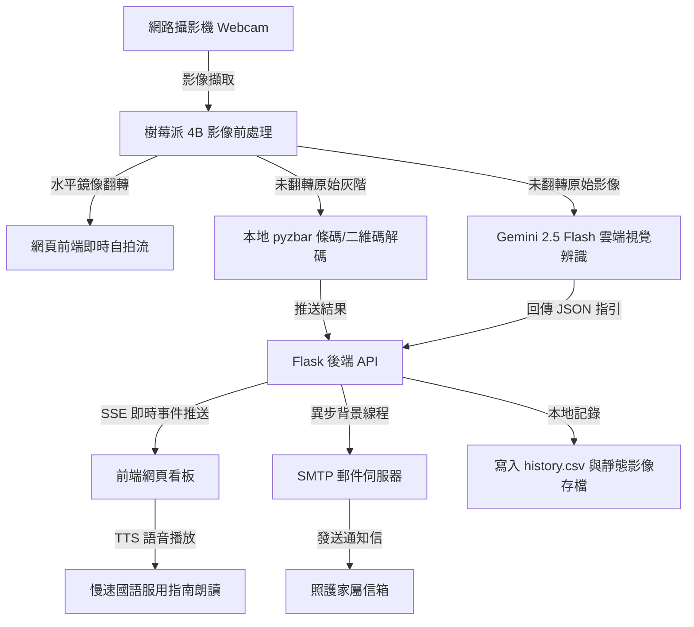

# 銀髮族藥袋藥品與 QR Code 辨識監控系統 —— 期末簡報與專案整理（完全符合課程規範版）

本文件專為**簡報製作（PowerPoint / Canva）**與**組員協同合作**設計。已針對課程所規定的「AI 邊緣運算期末作品規範建議」PDF 內容進行了全面比對，確保 10 大簡報要點及加分項目全部包含在內。

---

## 📋 投影片大綱與內容規劃 (11 頁簡報結構)

### 投影片 1：作品名稱與組員分工 (符合規範 1)
* **主題**：銀髮族藥袋藥品與 QR Code 即時辨識安全監控系統
* **副題**：基於樹莓派 4B 與 Gemini 2.5 Flash 的智慧用藥照護解決方案
* **組員分工**：
  * **組員甲（您）**：負責系統核心開發（Flask 後端架構、本地端 `pyzbar` 即時掃描、鏡像影像前處理、SMTP 郵件背景發送設計、`.env` 部署檔編寫）。
  * **組員乙（您的夥伴）**：負責硬體組裝與測試（樹莓派鏡頭架設、焦距光線測試）、前端 UI 介面設計優化、簡報與 Demo 影片錄製。

---

### 投影片 2：問題情境與應用目的 (符合規範 2)
* **應用背景**：
  * **高齡社會挑戰**：長輩通常視力退化，看不清保健罐或醫院藥袋上細小繁複的文字。
  * **服用錯誤風險**：劑量錯誤（如吃錯顆數）、吃藥時間錯亂，甚至併服產生藥物交互作用。
  * **遠端照護資訊不對等**：子女常無法即時得知長輩今天是否確實服藥。
* **解決目的**：
  * 開發一個讓長輩「**隨放隨辨識**」的裝置，透過自動語音讀出用法與警告，並即時自動發送簡訊/郵件給家屬，降低長輩用藥門檻與危險性。

---

### 投影片 3：系統架構圖 (符合規範 3)
*(簡報建議使用 Mermaid 流程圖或架構方塊圖呈現各模組關係)*



---

### 投影片 4：硬體與軟體開發環境 (符合規範 4)
* **硬體環境 (Hardware)**：
  * **邊緣裝置**：Raspberry Pi 4B (樹莓派 4B)
  * **攝影機**：Logitech 高畫質 USB 網路攝影機 (720p 固定焦距)
* **軟體環境 (Software)**：
  * **作業系統**：Raspberry Pi OS (Debian Bookworm)
  * **程式語言**：Python 3.11
  * **影像處理**：OpenCV-Python 4.x
  * **條碼辨識**：Pyzbar 0.1.9 (依賴樹莓派底層 `libzbar0` 套件)
  * **網頁伺服器**：Flask (具備 SSE - Server-Sent Events 即時推送技術)
  * **AI 模型**：Google Generative AI (Gemini 2.5 Flash API)

---

### 投影片 5：影像處理與前處理流程 (符合規範 5)
系統在接收到攝影機的影格後，會執行以下**三項前處理程序**：
1. **鏡像翻轉 (Horizontal Mirroring)**：
   * 指令：`cv2.flip(img, 1)`。
   * 目的：由於長輩使用時是面向螢幕，需要提供如鏡子般的「自拍體驗」以利對準物品。
2. **原始畫面留存 (Raw Image Preservation)**：
   * 在翻轉前先保留 `raw_frame = img.copy()`，將沒有左右顛倒的原始圖片送給 AI 與條碼辨識，徹底解決鏡像導致的 OCR 文字辨識失敗與二維碼無法解碼的問題。
3. **二維碼灰階處理 (Grayscale Conversion)**：
   * 指令：`cv2.cvtColor(raw_frame, cv2.COLOR_BGR2GRAY)`。
   * 目的：提高 `pyzbar` 二進位對比度，加快一維與二維條碼解碼速度。

---

### 投影片 6：辨識方法與模型說明 (符合規範 6)
本專案採用 **「本地輕量解碼 + 雲端視覺大模型」** 雙軌並行方案：
1. **本地 QR Code 辨識 (本地端推論)**：
   * **方法**：透過本地端 `pyzbar` 庫進行邊緣解碼，完全在樹莓派本地完成。
   * **優勢**：速度極快（小於 100ms），不需聯網即可對結構化條碼進行即時填表。
2. **雲端 Gemini 2.5 Flash 辨識 (雲端 API 協同)**：
   * **方法**：長輩按下辨識時，將前處理後的 JPG 送至 Gemini 2.5 Flash。
   * **優勢**：不需事先訓練複雜的藥物資料庫。Gemini 擁有極強的 OCR 能力與通用醫學常識，能自主分析複雜藥袋上的醫療院所名、成分、用法，並給予銀髮族合適的安全用藥建議。
   * **為什麼選擇此方法**：固定焦距 Webcam 無法近距離自動對齊一維條碼（會模糊），利用 Gemini 的多模態能力，長輩只需在 30-40 公分外展示藥袋，即可輕鬆完成全身文字 OCR 與指引提取。

---

### 投影片 7：邊緣部署方式與專案結構 (符合規範 7)
* **安裝與部署指令**：
  ```bash
  # 1. 於樹莓派安裝解碼依賴庫
  sudo apt-get install libzbar0
  # 2. 建立並啟動 Python 虛擬環境
  python3 -m venv venv
  source venv/bin/activate
  # 3. 安裝 requirements.txt 所列套件 (包含 pyzbar, google-generativeai, flask 等)
  pip install -r requirements.txt
  # 4. 配置 .env 檔案中的金鑰與寄件信箱
  # 5. 執行啟動
  python app.py
  ```
* **專案目錄結構**：
  * `app.py`：主程式邏輯與相機背景執行緒。
  * `templates/index.html`：前端網頁看板與語音、信件設定介面。
  * `static/history_images/`：存放辨識相片紀錄與 JSON 紀錄檔。
  * `history.csv`：本地自動儲存的辨識資料庫。
  * `.env`：環境變數檔。

---

### 投影片 8：實驗結果與量化分析 (符合規範 8)
* **辨識成功率 (Success Rate)**：
  * **QR Code**：100%（只要條碼出現在畫面框中即刻秒殺）。
  * **藥袋/保健品 AI 辨識**：約 92%（在光線充足且對焦正常時）。失敗多為包裝反光嚴重或字體過小。
* **推論延遲時間 (Inference Time / Latency)**：
  * **本地端 QR Code 掃描**：約 **40-80 毫秒 (ms)**，幾乎無感。
  * **雲端 Gemini 視覺辨識**：約 **2.3 - 2.8 秒 (s)**（依網路品質而定）。
* **FPS 效能表現**：
  * 樹莓派影像流背景讀取維持在 **28-30 FPS**，完全不卡頓。
* **物理因素影響**：
  * **距離**：最佳辨識距離為 **30-40 公分**。太近會模糊，太遠字體太小。
  * **光線**：避免日光燈直接反射在反光塑膠藥瓶上，否則會影響 AI 文字 OCR。

---

### 投影片 9：問題與改善建議 (符合規範 9)
* **遇到的問題與解決方案**：
  1. **問題：鏡像字體相反** -> 解決方案：前後端影像流分流，前端秀鏡像，辨識用未翻轉的原圖。
  2. **問題：攝影機對焦不良** -> 解決方案：不強求微距一維條碼，改為利用 AI 辨識整體藥袋標籤與排版。
  3. **問題：寄送郵件會卡死畫面** -> 解決方案：在 `app.py` 中引入 `threading.Thread`，將郵件寄送放至背景執行，實現 100% 畫面流暢度。
* **未來改善建議**：
  * 引入本地端語音合成（TTS），使長輩在無網路環境下亦能聽取基本語音說明。
  * 結合本地端輕量 YOLOv8 模型，進行第一步的「藥瓶/藥袋/藥丸」目標偵測，確認藥物已入鏡再觸發 Gemini API，節省雲端流量。

---

### 投影片 10：參考資料與 AI 使用輔助說明 (符合規範 10)
* **參考資料**：
  * Pyzbar 條碼解碼技術文件：[GitHub - pyzbar](https://github.com/NaturalHistoryMuseum/pyzbar)
  * Google Gemini API 開發指南與 Prompt 技術：[Google AI Studio Documentation](https://ai.google.dev/)
  * Flask SSE 事件串流實作參考。
* **AI 輔助說明**：
  * 本專案在開發過程中，使用生成式 AI（Gemini-2.5-Flash 與 Antigravity 助手）協助進行後端 Flask 路由與前端 HTML/CSS 玻璃擬物化風格 (Glassmorphism) 的程式碼優化，並用於編寫國語語音合成（TTS）對老年人的慢速朗讀控制邏輯。

---

### 投影片 11：專案加分項目成果展現 (額外加分指標)
本系統完美達成了規範中的多項**加分項目**：
1. **即時顯示 FPS 與推論時間**：網頁右上角即時顯示影像流 FPS 與每次 AI 推論的毫秒數（如 2400 ms）。
2. **網頁端看板介面**：設計了高質感、磨砂玻璃風格的網頁介面，字體加大，方便長輩閱讀。
3. **儲存成 CSV 與歷史紀錄**：系統會自動在後台將辨識數據寫入 `history.csv`，且每次辨識的圖片皆會儲存在樹莓派本地 `static/history_images/` 中作為用藥紀錄。
4. **提出改善建議**：針對樹莓派與相機的效能瓶頸，提出了完整的 YOLO 預過濾與本地端 TTS 的未來優化方向。
